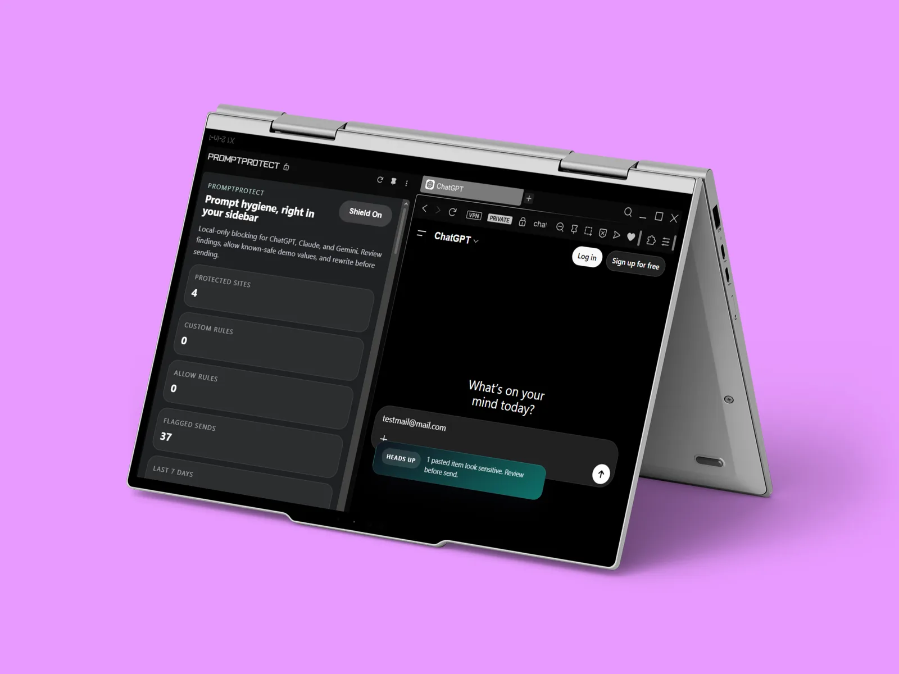

# PromptProtect

**Catch secrets before you paste them into an AI chat.**

PromptProtect is a Chrome extension that watches the message box on ChatGPT, Claude and Gemini. If what you're about to send looks like an API key, a private key, a token or personal data, it stops the send and shows you exactly what it found — then lets you send a redacted version instead. Everything runs locally in your browser.



Landing page: **[azyzex.github.io/PromptProtect](https://azyzex.github.io/PromptProtect/)**

## What it catches

- OpenAI-style API keys, AWS access keys, GitHub tokens
- JWTs and PEM private-key blocks
- Secret assignments (`API_KEY=…`), bearer tokens and database connection strings
- Emails and phone numbers
- Your own rules — custom regex patterns, stored locally

It checks text as you paste it and again on send, and scans common text attachments before they go out.

## How you fix it

When something is flagged, a review step highlights each match and offers three ways to send it safely:

| Mode | `sk-proj-4f9Kx2Lm8Qa7` becomes |
| --- | --- |
| Safe rewrite | `<OPENAI_API_KEY>` |
| Mask | `sk-p**************a7` |
| Full redact | `[REDACTED]` |

…or you send it as-is, on purpose.

## Privacy

- Detection is 100 % local — nothing is sent anywhere.
- The extension only runs on a small allowlist of sites, so its permissions stay tight.
- Its logs store counts and rule names, never the sensitive text itself.

## Install (from source)

```bash
npm install
npm run build
```

Then in Chrome: `chrome://extensions` → enable **Developer mode** → **Load unpacked** → pick the `dist` folder.

## Project structure

```
src/
├── content/    composer detection, paste + attachment scanning, warnings, review modal
├── background/ storage and local telemetry
├── popup/      per-site profiles, allowlists, rule packs, diagnostics, prompt test lab
├── sidepanel/  side panel UI
└── shared/     detection engine, redaction helpers, site definitions, types
static/         manifest.json, popup and side-panel HTML/CSS, icons
docs/           landing page (GitHub Pages)
```

## Built with

TypeScript · Chrome Extensions (Manifest V3) · esbuild

---

Made by [Mohamed Aziz Guenni](https://azyzex.github.io/AzyzPortfolio/)
